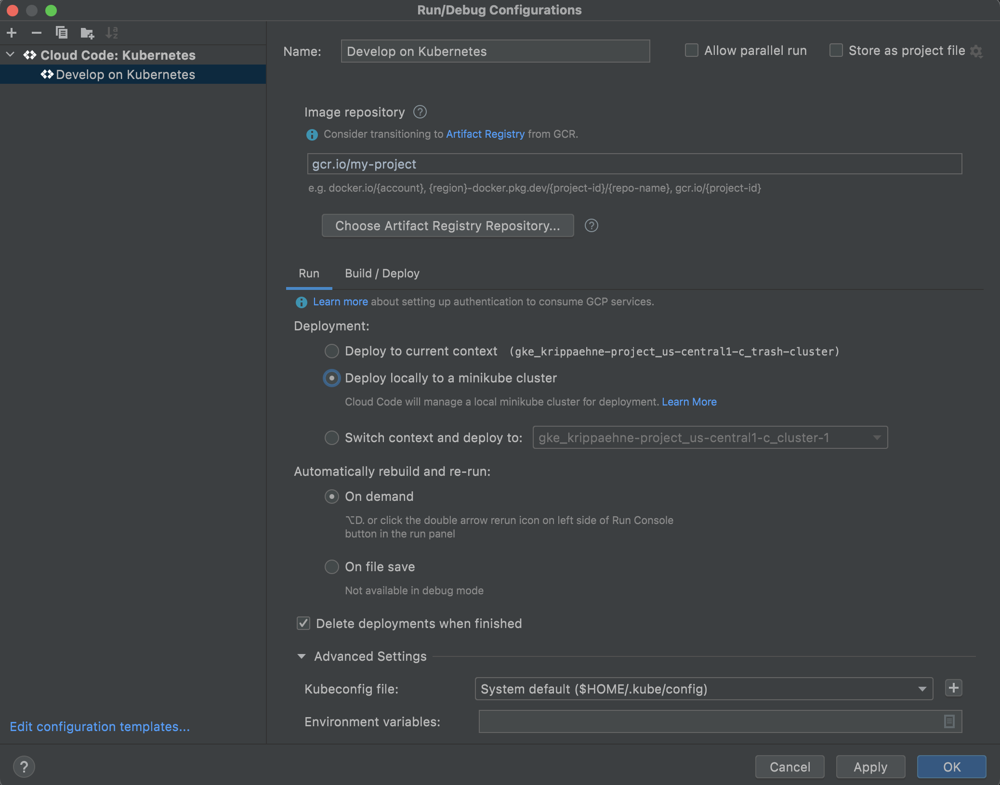
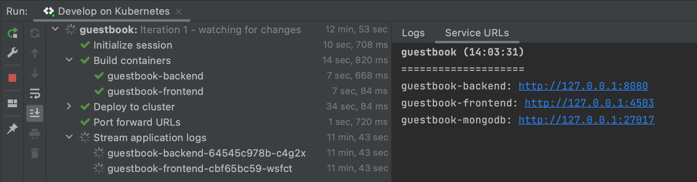

# Guestbook with Cloud Code

The Guestbook sample demonstrates how to deploy a Kubernetes application with a front end service and a back end service using the Cloud Code IDE extension.  

For details on how to use this sample as a template in Cloud Code, read the documentation for Cloud Code for [VS Code](https://cloud.google.com/code/docs/vscode/quickstart-local-dev?utm_source=ext&utm_medium=partner&utm_campaign=CDR_kri_gcp_cloudcodereadmes_012521&utm_content=-) or [IntelliJ](https://cloud.google.com/code/docs/intellij/quickstart-k8s?utm_source=ext&utm_medium=partner&utm_campaign=CDR_kri_gcp_cloudcodereadmes_012521&utm_content=-).

### Table of Contents
* [如何加上監控機制](#how-to-monitor)
* [What's in this sample](#whats-in-this-sample)
* [Getting Started with VS Code](#getting-started-with-vs-code)
* [Getting Started with IntelliJ](#getting-started-with-intellij)
* [Sign up for User Research](#sign-up-for-user-research)
---
## How to monitor
這個章節我們示範如何使用
1. JMX產生Prometheus Metrics顯示 JVM裡的相關數據
2. 產生Trace來確認服務呼叫間的延遲狀況
底下我們介紹如何在Java POM.xml裡的設定，並示範如何設定訊息的Collector

### Configure Agents in Java
#### JMX Agent
使用[JMX Agent](https://github.com/prometheus/jmx_exporter?tab=readme-ov-file#running-the-java-agent)，主要是通過在執行java程式時，通過-javaagent的方式，加載執行jmx_prometheus_javaagent-0.19.0.jar檔），這個加載的機制，在jib-maven-plugin中，需通過jvmflag呼叫，並通過extraDirectories的設定，將上述的jar檔複製到容器中進行加載。。

除了jar檔外，還需搭配一個configuration.yaml的設定檔案：我們這裡設定是保留所有JMX預設的參數。該設定檔主要說明如[連結所示](https://github.com/prometheus/jmx_exporter?tab=readme-ov-file#configuration)。有相關範例[詳列如連結](https://github.com/prometheus/jmx_exporter/tree/main/example_configs)。

#### OpenTelemetry Agent
使用[OpenTelemetry Agent](https://opentelemetry.io/docs/instrumentation/java/getting-started/)主要是用來產生呼叫Trace，Java的加載方式與上述JMX Agent類似，都是通過加載opentelemetry-javaagent.jar在javaagent參數中。

與jmx-agent不同之處是設定部分，目前的opentelemetry agent是以發送方式為主，其發送的設定參數，需帶在容器執行的環境變數中，詳細參數[請見本連結](https://opentelemetry.io/docs/specs/otel/configuration/sdk-environment-variables/#general-sdk-configuration)。在K8s裡，也不少方式可以生成環境變數，這裡我們使用最簡單的方式：YAML加載為主，示意如下。
```
        - name: OTEL_TRACES_EXPORTER
          value: otlp
        - name: OTEL_EXPORTER_OTLP_ENDPOINT
          value: http://ubuntu0.default.svc:4317
        - name: OTEL_TRACES_SAMPLER
          value: parentbased_traceidratio
        - name: OTEL_TRACES_SAMPLER_ARG
          value: "1.0"
```

### Configure Collectors
#### Prometheus Collectors
收集JMX的數據，我們第一個想法是使用Google Managed Prometheus(GMP)裡所準備的PodMonitoring 物件，通過matchLabel selector，我們可以快速將上述JMX Agent的數據，以30秒的頻率傳送回GMP。
```
apiVersion: monitoring.googleapis.com/v1
kind: PodMonitoring
metadata:
  name: frontend-monitoring
  namespace: default
spec:
  endpoints:
  - interval: 30s
    port: metrics
  selector:
    matchLabels:
      app: java-guestbook
```

#### OpenTelmetry Collectors
OpenTelemetry Collector的部署，平常很多人會使用[OpenTelemetry Operator](https://github.com/open-telemetry/opentelemetry-operator)來進行部署，但由於其設定就為抽象（僅有YAML檔）。這裡我們選擇介紹[bindplane](https://observiq.com/docs/getting-started/quickstart-guide)來部署，給大家多一個UI的選擇。

* 部署Linux Pod
我們準備一個Ubuntu:latest的Pod作為Collector之用，由於等等這個Collector也會提供Trace送入資料，我們也對其增加一層K8S service確保FQDN不變。

* 部署Bindplane Ops Server
bindplane的K8S部署，需要先部署bindplane ops server，可通過[helm chart](https://github.com/observIQ/bindplane-op-helm)
```
helm repo add "bindplane" "https://observiq.github.io/bindplane-op-helm"

cat << EOF > values.yaml
config:
  username: "admin"
  password: "admin"
  secret_key: "13c15d7c-233e-49e3-bef4-f7498f33518f"
  sessions_secret: "a4e5aa85-5df4-4edd-8cfe-d8a7257d09dd"
EOF

helm repo update
helm upgrade --install "bindplane" \
    --values "values.yaml" \
    --namespace bindplane \
    --create-namespace \
    bindplane/bindplane
```
部署成功後，執行下方腳本，將bindplane service改為LoadBalancer
```
kubectl patch services bindplane -n bindplane -p '{"spec":{"type":"LoadBalancer"}}'
```

* 設定Bindplane Agent於Ubuntu上
等到LoadBalancer的IP位置產生後，即可登入，我們先進入Configuration Tab，並選擇使用Linux Agent (提供較多的Source可供使用)的方式，我們選擇OpenTelemetry與Prometheus的兩種Sources，並對應設定Google Cloud以及Google Managed Prometheus兩個Exporters，如下圖。
" install_unix.sh -e ws://bindplane.bindplane.svc.cluster.local:3001/v1/opamp -s 13c15d7c-233e-49e3-bef4-f7498f33518f -v 1.41.0 -k configuration=prometheus,install_id=e8a20a64-5356-4447-abed-ed75bae6e603
```


### Directory contents

- `skaffold.yaml` - A schema file that defines skaffold configurations ([skaffold.yaml reference](https://skaffold.dev/docs/references/yaml/))
- `kubernetes-manifests/` - Contains Kubernetes YAML files for the Guestbook services and deployments, including:

  - `guestbook-frontend.deployment.yaml` - deploys a pod with the frontend container image
  - `guestbook-frontend.service.yaml` - creates a load balancer and exposes the frontend service on an external IP in the cluster
  - `guestbook-backend.deployment.yaml` - deploys a pod with the backend container image
  - `guestbook-backend.service.yaml` - exposes the backend service on an internal IP in the cluster
  - `guestbook-mongodb.deployment.yaml` - deploys a pod containing a MongoDB instance
  - `guestbook-mongodb.service.yaml` - exposes the MongoDB service on an internal IP in the cluster

---
## Getting Started with VS Code

### Run the app locally with minikube

#### Edit run configuration
1. Click the configuration dropdown in the top taskbar and then click **Edit Configurations**.
   

   The **Develop on Kubernetes** configuration watches for changes, then uses [skaffold](https://skaffold.dev/docs/) to rebuild and rerun your app. You can customize your deployment by making changes to this run configuration or by creating a new Cloud Code: Kubernetes run configuration.


3. Under **Run > Deployment**, select 'Deploy locally to a minikube cluster'.
   

4. Click **OK** to save your configuration.


#### Run the app on minikube
1. Select **Develop on Kubernetes** from the configuration dropdown and click the run icon. Cloud Code runs your app in a local [minikube](ttps://minikube.sigs.k8s.io/docs/start/) cluster.  
   


2. View the build process in the output window. When the deployment is successful, you're notified that new service URLs are available. Click the Service URLs tab to view the URL(s), then click the URL link to open your browser with your running application.  
   

3. To stop the application, click the stop icon next to the configuration dropdown.

---

## Getting Started with IntelliJ

### Run the app locally with minikube

#### Edit run configuration
1. Click the configuration dropdown in the top taskbar and then click **Edit Configurations**.


   The **Develop on Kubernetes** configuration watches for changes, then uses [skaffold](https://skaffold.dev/docs/) to rebuild and rerun your app. You can customize your deployment by making changes to this run configuration or by creating a new Cloud Code: Kubernetes run configuration.


3. Under **Run > Deployment**, select 'Deploy locally to a minikube cluster'.


4. Click **OK** to save your configuration. 


#### Run the app on minikube
1. Select **Develop on Kubernetes** from the configuration dropdown and click the run icon. Cloud Code runs your app in a local [minikube](ttps://minikube.sigs.k8s.io/docs/start/) cluster.  


2. View the build process in the output window. When the deployment is successful, you're notified that new service URLs are available. Click the Service URLs tab to view the URL(s), then click the URL link to open your browser with your running application.  


3. To stop the application, click the stop icon next to the configuration dropdown.

---
## Sign up for User Research

We want to hear your feedback!

The Cloud Code team is inviting our user community to sign-up to participate in Google User Experience Research. 

If you’re invited to join a study, you may try out a new product or tell us what you think about the products you use every day. At this time, Google is only sending invitations for upcoming remote studies. Once a study is complete, you’ll receive a token of thanks for your participation such as a gift card or some Google swag. 

[Sign up using this link](https://google.qualtrics.com/jfe/form/SV_4Me7SiMewdvVYhL?reserved=1&utm_source=In-product&Q_Language=en&utm_medium=own_prd&utm_campaign=Q1&productTag=clou&campaignDate=January2021&referral_code=UXbT481079) and answer a few questions about yourself, as this will help our research team match you to studies that are a great fit.
