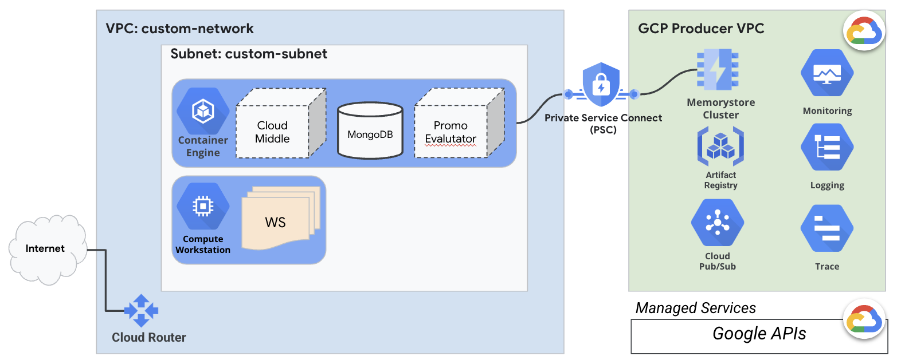

# pubsub_sample
這個專案展示如何使用Custom Metrics Service來監控GCP PubSub裡面的num_undelivered_messages，並通過這個Horizontal Pod Autoscaler v2的機制，來自動生成Pod來計算尚未處理的訊息。

## 創建Custom Metrics Server
這個機制需要在k8s叢集中 先搭建一個custom metrics server，目前GCP有提供stackdriver介接的custom metrics server，先通過workload identity提供權限
```
# set up workload identity to enable k8s service account metrics viewer capabilities
gcloud iam service-accounts add-iam-policy-binding --role \
  roles/iam.workloadIdentityUser --member \
  "serviceAccount:<project-id>.svc.id.goog[custom-metrics/custom-metrics-stackdriver-adapter]" \
  <google-service-account>@<project-id>.iam.gserviceaccount.com

kubectl annotate serviceaccount --namespace custom-metrics \
  custom-metrics-stackdriver-adapter \
  iam.gke.io/gcp-service-account=<google-service-account>@<project-id>.iam.gserviceaccount.com
```
Apply k8s yaml
```
kubectl apply -f https://raw.githubusercontent.com/GoogleCloudPlatform/k8s-stackdriver/master/custom-metrics-stackdriver-adapter/deploy/production/adapter_new_resource_model.yaml
```

### 測試
創造一個Pubsub topic and subscription (如[下方terraform script](#infrastructure-by-terraform))，通過以下命令，可以確認是否custom metrics server已經可以被使用：
```
kubectl get --raw '/apis/external.metrics.k8s.io/v1beta1/namespaces/default/pubsub.googleapis.com|subscription|num_undelivered_messages' | jq .
{
  "kind": "ExternalMetricValueList",
  "apiVersion": "external.metrics.k8s.io/v1beta1",
  "metadata": {},
  "items": [
    {
      "metricName": "pubsub.googleapis.com|subscription|num_undelivered_messages",
      "metricLabels": {
        "resource.labels.project_id": "shawnho-demo-2023",
        "resource.labels.subscription_id": "echo-read",
        "resource.type": "pubsub_subscription"
      },
      "timestamp": "2024-01-07T13:53:41Z",
      "value": "0"
    },
  ]
}
```

### HPA v2
使用HPA來依據Pubsub 以平均(averageValue): "2"，來autoscale對應的Pod數量。
```
apiVersion: autoscaling/v2
kind: HorizontalPodAutoscaler
metadata:
  name: pubsub
spec:
  minReplicas: 1
  maxReplicas: 5
  metrics:
  - external:
      metric:
       name: pubsub.googleapis.com|subscription|num_undelivered_messages
       selector:
         matchLabels:
           resource.labels.subscription_id: echo-read
      target:
        type: AverageValue
        averageValue: "2"
    type: External
  behavior:
    scaleDown:
      stabilizationWindowSeconds: 15
      policies:
      - type: Percent
        value: 100
        periodSeconds: 15
  scaleTargetRef:
    apiVersion: apps/v1
    kind: Deployment
    name: pubsub-deployment
```

## Infrastructure by Terraform
這部分我們說明此次TAP所建置的測試環境，如下圖：

主要包含了以下各個部分：
1. Runtime：
    * VPC網路, 包含對外的Cloud Router + SNAT Gateway
    * Private GKE Cluster on VPC
    * MemoryStore Cluster Mode
    * PubSub Topic/Subscription
2. 開發使用：
    * Cloud Workstation
    * Artifact Docker Registry

